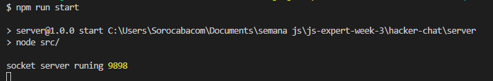
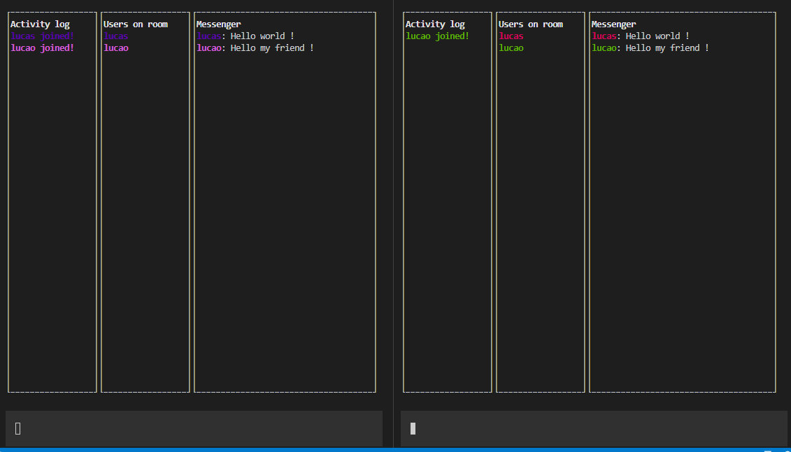

# Hacker Chat

Este repositório contém os arquivos desenvolvidos durante a semana JS Expert 3, do professor [ErickWendel](https://erickwendel.teachable.com/) 

O projeto Hacker Chat é uma aplicação com interface visual para linha de comandos com trocas de mensagens entre  usuários, onde possui o lado cliente e o lado servidor. Utilizando os conceitos do Node de #websocket e #eventEmitter.

Para executar a aplicação, existem duas possibilidades, localmente ou pela internet.

## 1 - Localmente

### 1.1 - Requisitos de ambiente

-Node 15^~
-Npm

### 1.2 - Como executar:

Clone este repositório, navegue para a pasta 'hacker-chat' e execute em dois terminais de linha de comando diferentes:

No terminal 1:

- cd server (entrar na pasta do servidor local)

- npm install (instalar as dependências)

- npm run start

Você deverá ver a execução do server conforme abaixo:

No terminal 2: (com o server em execução através do terminal 1), execute:

- cd client (entrar na pasta do cliente)

- npm install (instalar as dependências)

- npm run user01 (simular a entrada no chat de um usuário)

- npm run user02 (simular a entrada no chat de um usuário)

- Se tudo ocorrer bem, efetue trocas de mensagens entre os usuários:

## 2 - Pela internet

Para executar o chat atráves da internet, sem clonar o repositório pelo passo anterior, você pode
instalar o mesmo globalmente através do Npm.js. Para isto, execute em seu terminal de comandos:

- npm i -g @lucassantosagencia/hacker-chat-client (instalar o projeto cliente globalmente em sua máquina)

( com isto, o comando 'hacker-chat' será registrado como comando global na máquina)

- hacker-chat --username <seu nome> (para entrar no chat)

- hacker-chat --username <seu nome> (Em outro terminal aberto, execute somente este comando para entrar no chat com outro usuário)

- Envie mensagens: 

### 2.1 - Observações - 1

O lado servidor está hospedado no [Heroku.com](https://www.heroku.com/) e o cliente esta registrado como um pacote oficial [npmjs](https://www.npmjs.com/) que publiquei em minha conta.

Ambas aplicações foram feitas o processo de deploy no dia 08-04-2021, então caso a execução deste projeto pela internet não funcione nesta etapa, é devido à não disponibilidade de alguns destes serviços.

### 2.1 - Observações - 2

Caso queira remover o pacote 'cliente' de sua máquina, assim como o comando global 'hacker-chat' de seu terminal, instalado no passo da instalação, execute:

- npm unlink -g @lucassantosagencia/hacker-chat-client